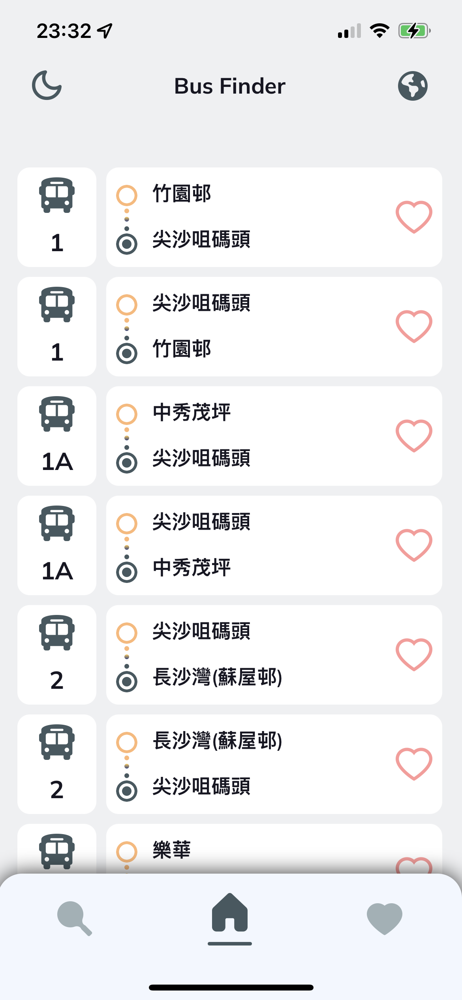
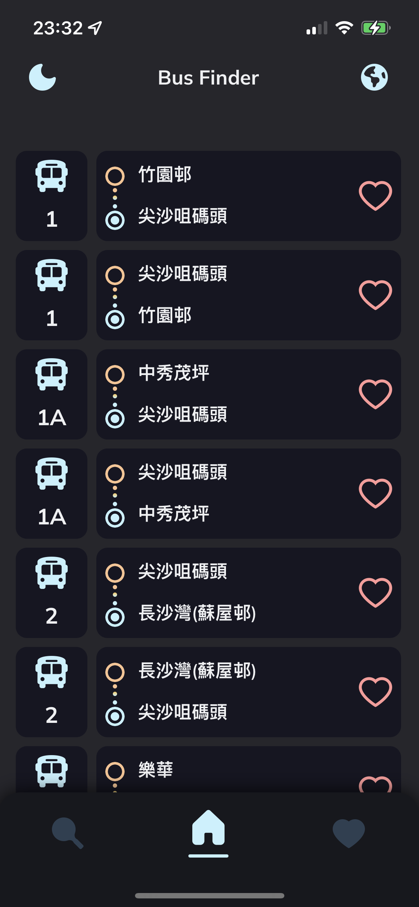
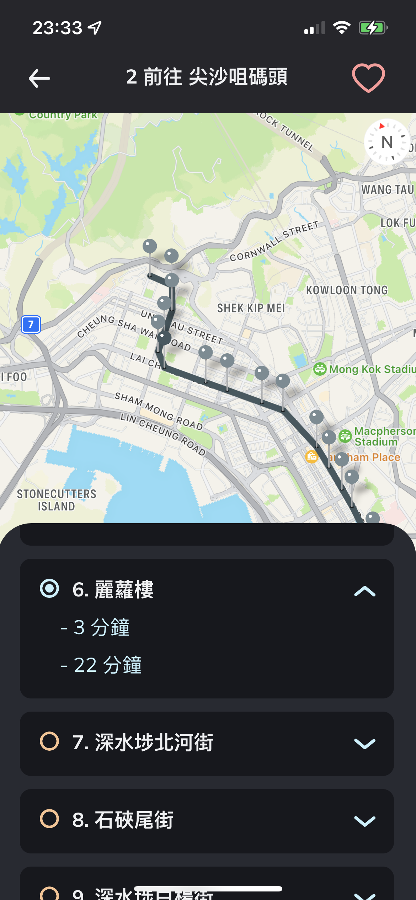
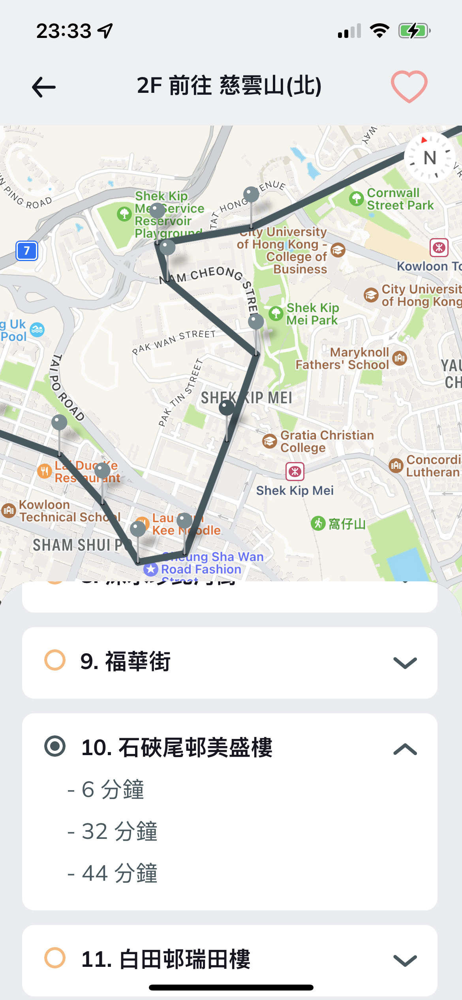

# RNProject Template

This is a bus searching app called Bus Finder.

Features:

- Show all the bus route in a list
- Search bus route
- Add favourite list
- Locate the bus stop and show 3 ETA
- Theme Change (Dark, Light)

Sample Screen:






## Prerequisite

- Xcode 13.2.1
- Android Studio Bumblebee | 2021.1.1
- Visual Studio Code 1.64.1
- Node v12.18.2 ( Better to use nvm)
- react-native-cli: 2.0.1
- react-native: 0.64.0
- VS Code Plugin - Prettier, ESLint ( Align Coding Style )

## Installation

```bash
npm install
npx pod-install ios
```

## Run

To run the app:

`iOS`

scheme can have 'RNProject-DEV', 'RNProject-SIT', 'RNProject-UAT', 'RNProject-PROD'

For the first time you run it in Xcode, it may fail, please close and reopen XCode and run again.

```bash
react-native run-ios --scheme=RNProject-DEV
```

Or you may choose the scheme in Xcode and click run.

`Android`

variant can have 'debug', 'sit', 'uat', 'release'

```bash
react-native run-android --appId=com.busfinder.uat --variant=uat
```

Or you may choose the variant in Android Studio and click run.

To make a release build:

```bash
cd android
./gradlew assembleRelease
```

You may assembleSit, assembleUat, assembleRelease, the apk will be generated in release config.

## Import

All import statement should follow the following:

```javascript
import useAppTheme from '~src/contexts/theme';
```

~src is the root path alias of ~/src

## Coding Style

`Prettier & ESLint` will be used for aligning coding style. Please ensure they are installed.

`Variable / function name` will be named in `Camel Case`.

`js files / class name / component name` will be named in `Pascal Case`.

## Environment

[React Native Config](https://github.com/luggit/react-native-config) has been used for configurating different environment. .env files are located in root directory and environment variables can be found inside it.

## Responsive UI

The design on Figma is using iPhone Pro Max which is 414 X 896. When there is a need for inputting exact value for height/width/padding/margin, you can use below functions which are defined in ~src/styles/Mixins. You can input the exact value form Figma in these functions. These functions will do the scaling on different screen size.

```javascript
const guidelineBaseWidth = 414;
const guidelineBaseHeight = 896;

export const sw = wp; // scaleWidth
export const sh = hp; // scaleHeight
```

You can have a look on the project before you write any code.

## Other Useful Links

Please visit below websites before coding:

[Context API](https://reactjs.org/docs/context.html)

[React Navigation v6](https://reactnavigation.org/docs/getting-started)
